# Credit Risk Analysis - Unbalanced Machine Learning

## Objective
Credit risk is an inherently unbalanced classification problem, as good loans easily outnumber risky loans. Therefore, one will need to employ different techniques to train and evaluate models with unbalanced classes.

## Technologies Used
- imbalanced-learn: https://imbalanced-learn.org/stable/introduction.html
- scikit-learn: https://scikit-learn.org/stable/getting_started.html

## Background
Using the credit card credit dataset from LendingClub, a peer-to-peer lending services company, I oversampled the data using the RandomOverSampler and SMOTE algorithms, and undersampled the data using the ClusterCentroids algorithm. Then, I used a combinatorial approach of over- and undersampling using the SMOTEENN algorithm. Next, I compared two new machine learning models that reduce bias, BalancedRandomForestClassifier and EasyEnsembleClassifier, to predict credit risk. I further evaluated the performance of these models and made a written recommendation on whether they should be used to predict credit risk.

## Data
We used data from LendingClub, a peer-to-peer lending services company
- LendingClub: https://help.lendingclub.com/hc/en-us/articles/215488038-What-do-the-different-Note-statuses-mean-

### Data Cleaning
Imported data sets for the first quarter of 2019. Null columns were dropped, as were any rows with empty columns. Rows with an "Issued" loan status were further removed as they were irrelevant in this analysis. Interest Rate was cast to an float datatype. High Risk loan status were derived by any loan with a status in the following:
- Late (31-120 days)
- Late (16-30 days)
- Default
- In Grace Period

Otherwise, a loan status of low_risk was assumed. 

Categorical variables were one-hot encoded, and our target of loan status was label encoded.

## Model Building and Results
After data preparation, our data consisted of 68,817 rows. We then performed a 75%/25% train/test split ratio, stratefied by our target.

For the first four models, a logistic regression was built around over and under sampled training data.

First, I applied oversampling techniques on our training set. The idea behind oversampling is simple and intuitive: If one class has too few instances in the training set, we choose more instances from that class for training until it's larger.
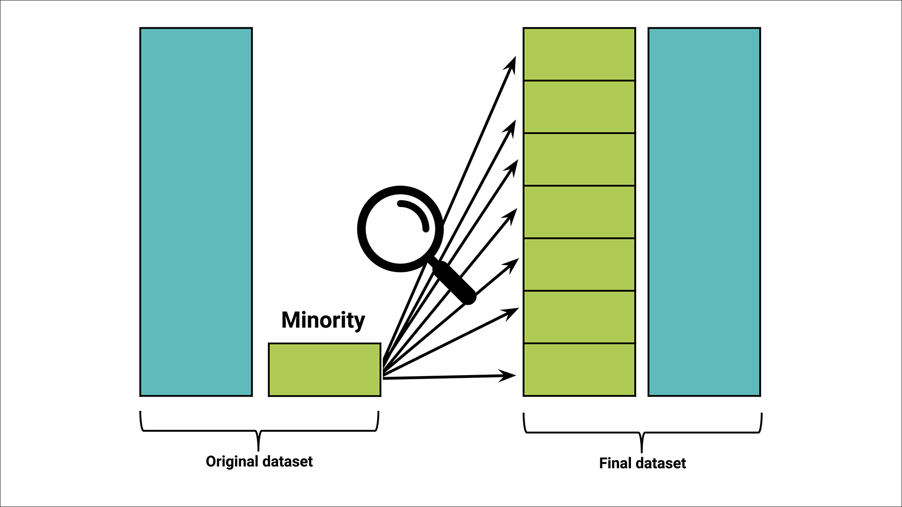

__Random Oversampling__

In random oversampling, instances of the minority class are randomly selected and added to the training set until the majority and minority classes are balanced.

Results:

- Accuracy: 65.25%
- High-Risk Precision: 0.01
- Low-Risk Precision: 1.00
- High-Risk Recall: 0.62
- Low-Risk Recall: 0.68
- High-Risk F1 Score: 0.02
- Low-Risk F1 Score: 0.81

Confusion Matrix:

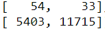

Classification Report:

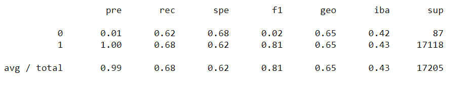

__SMOTE__

The synthetic minority oversampling technique (SMOTE) is another oversampling approach to deal with unbalanced datasets. In SMOTE, like random oversampling, the size of the minority is increased. The key difference between the two lies in how the minority class is increased in size. As we have seen, in random oversampling, instances from the minority class are randomly selected and added to the minority class. In SMOTE, by contrast, new instances are interpolated. That is, for an instance from the minority class, a number of its closest neighbors is chosen. Based on the values of these neighbors, new values are created.

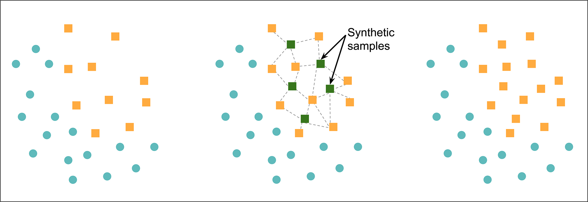

Results:

- Accuracy: 65.46%
- High-Risk Precision: 0.01
- Low-Risk Precision: 1.00
- High-Risk Recall: 0.64
- Low-Risk Recall: 0.67
- High-Risk F1 Score: 0.02
- Low-Risk F1 Score: 0.80

Confusion Matrix:

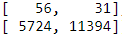

Classification Report:

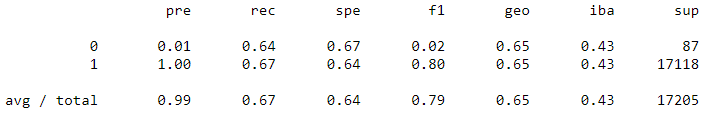

__Cluster Centroid Undersampling__

Cluster centroid undersampling is akin to SMOTE. The algorithm identifies clusters of the majority class, then generates synthetic data points, called centroids, that are representative of the clusters. The majority class is then undersampled down to the size of the minority class.

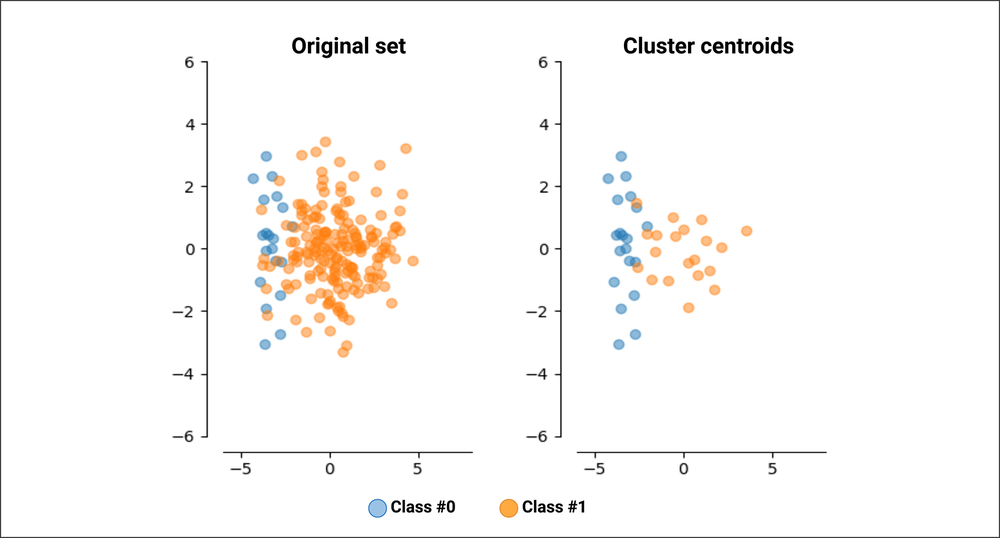

Results:

- Accuracy: 51.04%
- High-Risk Precision: 0.01
- Low-Risk Precision: 1.00
- High-Risk Recall: 0.59
- Low-Risk Recall: 0.43
- High-Risk F1 Score: 0.01
- Low-Risk F1 Score: 0.60

Confusion Matrix:

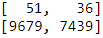

Classification Report:

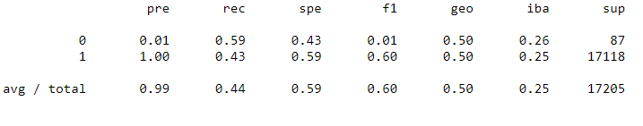

__SMOTEEN__

A downside of oversampling with SMOTE is its reliance on the immediate neighbors of a data point. Because the algorithm doesn't see the overall distribution of data, the new data points it creates can be heavily influenced by outliers. This can lead to noisy data. With downsampling, the downsides are that it involves loss of data and is not an option when the dataset is small. One way to deal with these challenges is to use a sampling strategy that is a combination of oversampling and undersampling.

SMOTEENN combines the SMOTE and Edited Nearest Neighbors (ENN) algorithms. SMOTEENN is a two-step process:

First, oversample the minority class with SMOTE.

Second, clean the resulting data with an undersampling strategy. If the two nearest neighbors of a data point belong to two different classes, that data point is dropped.

Results:

- Accuracy: 62.12%
- High-Risk Precision: 0.01
- Low-Risk Precision: 1.00
- High-Risk Recall: 0.69
- Low-Risk Recall: 0.55
- High-Risk F1 Score: 0.02
- Low-Risk F1 Score: 0.71

Confusion Matrix:

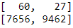

Classification Report:

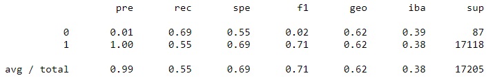

__Balanced Random Forest Classifier__

The Balanced Random Forest Classifier is an ensemble method in which each tree of the forest will be provided a balanced bootstrap sample of the training data. No oversampling or undersampling techniques is performed prior to training, after the train/test split.

Results:

- Accuracy: 78.78%
- High-Risk Precision: 0.04
- Low-Risk Precision: 1.00
- High-Risk Recall: 0.67
- Low-Risk Recall: 0.91
- High-Risk F1 Score: 0.07
- Low-Risk F1 Score: 0.95

Confusion Matrix:

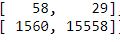

Classification Report:

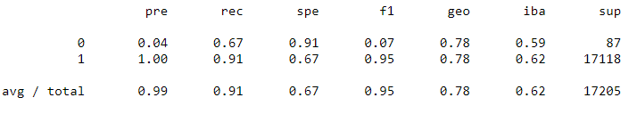

Important Features:

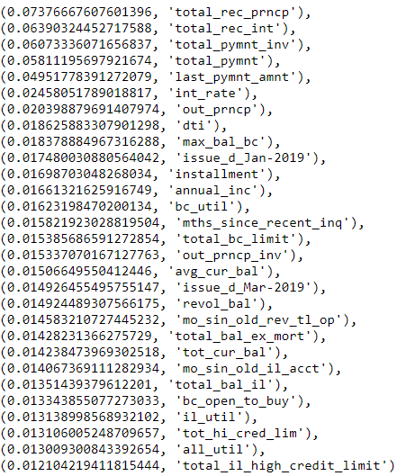

__Easy Ensemble Classifier__

A specific method which uses AdaBoostClassifier as learners in the bagging classifier is called "EasyEnsemble". The EasyEnsembleClassifier allows to bag AdaBoost learners which are trained on balanced bootstrap samples of the training data. No oversampling or undersampling techniques is performed prior to training, after the train/test split.

Results:

- Accuracy: 91.98%
- High-Risk Precision: 0.07
- Low-Risk Precision: 1.00
- High-Risk Recall: 0.90
- Low-Risk Recall: 0.94
- High-Risk F1 Score: 0.14
- Low-Risk F1 Score: 0.97

Confusion Matrix:

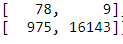

Classification Report:

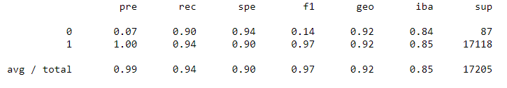

## Summary and Recommendation
Credit Risk is a situation in which high recall is very important. With credit risk, for example, a high recall is more important than high precision or overall accuracy. High recall means that among people who actually have high-risk credit scores, most of them will be classified correctly. High precision, on the other hand, means that if the model prediction comes back as high-risk, there's a high likelihood that the loan applicant is actually high-risk. As such, I focused on the high-risk recall when evaluating these models.

In terms of high-risk recall, the oversampling methods out-performed the Cluster Centroid undersampling method and the SMOTEEN algorithm. In fact, undersampling seemed to make the resulting worse. This is because data is dropped, which may be informative to the model.

However, both emsemble models outperformed the oversamplign methods. In fact, the AdaBoost classifier achieved a >90% recall for both high-risk and low-risk loan applicants in the testing set. This EasyEnsemble Classifier also had ~92% accuracy, and the best precision and F1 scores across all classes.

I would recommend that the EasyEnsemble Classifier be used in production, albeit with its known limitations. First and foremost, this model will return a lot of false-positives in the context of high-risk loan applications. 93% of predictions for high-risk applicants are not actually at a high risk of credit. This might cause many people who actually would benefit from a loan, and be responsible for it, to be denied. Further work needs to be done to see if this is an acceptible trade-off at the executive level.

## Limitations
There were a few limitations that came across in the exploration of this dataset. First, the dataset only included one quarter from one year. Further, many columns and rows were dropped, as they contained null values. Finally, the number of high-risk applicants was imbalanced in our data set.

## Future Work
In the future, it would be useful to expand the data by acquiring applications from other quarters and years. This would also expand the number of high-risk applicants in our training pool - which might benefit our model. Also, using an imbalanced ensemble method after oversampling might provide much needed context and increased recall.

Further, it was noted that scaling our input variables might increase our accuracy, as would dropping unnecessary or unpredictive columns. Finally, imputing the null values would reduce in less dropped data, which also might increase the model's accuracy.

Verifying with the executive team on an acceptable trade-off between false positives (loan denials for good applicants) and identifying high-risk applications (so as to not lose the bank money) is necessary before productionalizing any model.